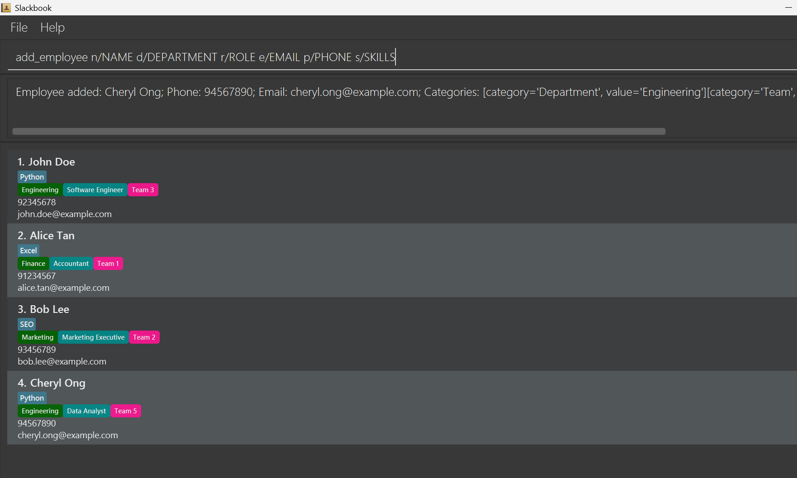

SlackBook is a **desktop app for managing contacts, optimized for use via a Command Line Interface** (CLI) inspired by AB3 while still having the benefits of a Graphical User Interface (GUI). If you can type fast, it can get your contact management tasks done faster than traditional GUI apps.

* Table of Contents
{:toc}

--------------------------------------------------------------------------------------------------------------------

## Quick start

1. Ensure you have Java `17` or above installed in your Computer. 
   **Mac users:** Ensure you have the precise JDK version prescribed [here](https://se-education.org/guides/tutorials/javaInstallationMac.html).

1. Download the latest `.jar` file from [here](https://github.com/AY2526S1-CS2103T-T08-3/tp/releases).

1. Copy the file to the folder you want to use as the _home folder_ for SlackBook.

1. Open a command terminal, `cd` into the folder you put the jar file in (e.g. `cd Desktop\slackbook`), and use the `java -jar slackbook.jar` command to run the application. 
   A GUI similar to the below should appear in a few seconds. Note how the app contains some sample data. 
   

1. Type the command in the command box and press Enter to execute it. e.g. typing **`help`** and pressing Enter will open the help window. 
   Some example commands you can try:

   * `list` : Lists all contacts.

   * `add_employee n/John Doe d/Engineering t/Team 3 r/Software Engineer e/john.doe@example.com p/92345678 s/Python` : Adds a contact named `John Doe` to the directory.

   * `delete_employee 3` : Prompts the confirmation of the deletion of the 3rd contact shown in the current list.

   * `clear` : Deletes all contacts.

   * `exit` : Exits the app.

1. Refer to the [Features](#features) below for details of each command.

--------------------------------------------------------------------------------------------------------------------

## Features

**:information_source: Notes about the command format:** 

* Words in `UPPER_CASE` are the parameters to be supplied by the user. 
  e.g. in `add n/NAME`, `NAME` is a parameter which can be used as `add n/John Doe`.

* Items in square brackets are optional. 
  e.g `n/NAME [s/SKILLS]` can be used as `n/John Doe s/Java` or as `n/John Doe`.

* Items with `…`​ after them can be used multiple times including zero times. 
  e.g. `[s/SKILLS]…​` can be used as ` ` (i.e. 0 times), `s/Java`, `s/Java s/Python` etc.

* Parameters can be in any order. 
  e.g. if the command specifies `n/NAME p/PHONE_NUMBER`, `p/PHONE_NUMBER n/NAME` is also acceptable.

* Extraneous parameters for commands that do not take in parameters (such as `help`, `list`, `exit` and `clear`) will be ignored. 
  e.g. if the command specifies `help 123`, it will be interpreted as `help`.

* If you are using a PDF version of this document, be careful when copying and pasting commands that span multiple lines as space characters surrounding line-breaks may be omitted when copied over to the application.

### Viewing help : `help`

Shows a message explaining how to access the help page.

Format: `help`

### Adding a person: `add_employee`

Adds a person to the directory.

Format: `add_employee n/NAME [d/DEPARTMENT] [t/TEAM] [r/ROLE] e/EMAIL p/PHONE [s/SKILLS]*`

:bulb: **Tip:**
A person can have any number of skills (including 0)

Examples:
* `add_employee n/John Doe d/Engineering t/Team 3 r/Software Engineer e/john.doe@example.com p/92345678 s/Python`
* `add_employee n/Alex Yeo d/HR t/Team A r/Manager e/alex.yeo@example.com p/92345678`

### Listing all persons : `list`

Allow HR managers to view all employees currently stored in the system in a clear and structured format.

Format: `list`

### Deleting a person : `delete_employee`

Deletes the specified person from the directory.

Format: `delete_employee INDEX`

* Prompts the confirmation of the deletion of the person at the specified `INDEX`.
* The index refers to the index number shown in the displayed person list.
* The index **must be a positive integer** 1, 2, 3, …​
* A confirmation prompt will be shown.
* Input `yes` to confirm the deletion.

Examples:
* `delete_employee 2` prompts the confirmation of the deletion of the 2nd person in the directory.

### Categorize employee : `assign_category`

Help users to organize employees by department, team, or role for easier navigation.

Format: `assign_category INDEX c/CATEGORY_TYPE v/VALUE`

* Categorize the person at the specified `INDEX`.
* The index refers to the index number shown in the displayed person list.
* The index **must be a positive integer** 1, 2, 3, …​

Examples:
* `assign_category 2 c/Department v/Engineering` assigns the 2nd person in the directory the Department, Engineering.

### Clearing all entries : `clear`

Clears all entries from the directory.

Format: `clear`

### Exiting the program : `exit`

Exits the program.

Format: `exit`

### Saving the data

Slackbook data are saved in the hard disk automatically after any command that changes the data. There is no need to save manually.

### Editing the data file

Slackbook data are saved automatically as a JSON file `[JAR file location]/data/addressbook.json`. Advanced users are welcome to update data directly by editing that data file.

:exclamation: **Caution:**
If your changes to the data file makes its format invalid, Slackbook will discard all data and start with an empty data file at the next run. Hence, it is recommended to take a backup of the file before editing it. 
Furthermore, certain edits can cause the Slackbook to behave in unexpected ways (e.g., if a value entered is outside of the acceptable range). Therefore, edit the data file only if you are confident that you can update it correctly.

--------------------------------------------------------------------------------------------------------------------

## FAQ

**Q**: How do I transfer my data to another Computer? 
**A**: Install the app in the other computer and replace the file `[JAR file location]/data/addressbook.json` with the file from the same location on your previous computer.

--------------------------------------------------------------------------------------------------------------------

## Known issues

1. **When using multiple screens**, if you move the application to a secondary screen, and later switch to using only the primary screen, the GUI will open off-screen. The remedy is to delete the `preferences.json` file created by the application before running the application again.
2. **If you minimize the Help Window** and then run the `help` command (or use the `Help` menu, or the keyboard shortcut `F1`) again, the original Help Window will remain minimized, and no new Help Window will appear. The remedy is to manually restore the minimized Help Window.

--------------------------------------------------------------------------------------------------------------------

## Command summary

Action | Format, Examples
--------|------------------
**Add** | `add_employee n/NAME [d/DEPARTMENT] [t/TEAM] [r/ROLE] e/EMAIL p/PHONE [s/SKILLS]*​`   e.g., `add_employee n/John Doe d/Engineering t/Team 3 r/Software Engineer e/john.doe@example.com p/92345678 s/Python`
**Clear** | `clear`
**Delete** | `delete_employee INDEX`  e.g., `delete 3`
**Categorize** | `assign_category INDEX c/CATEGORY_TYPE v/VALUE​`  e.g.,`assign_category 2 c/Department v/Engineering`
**List** | `list`
**Help** | `help`
